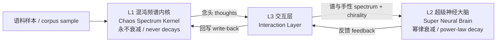
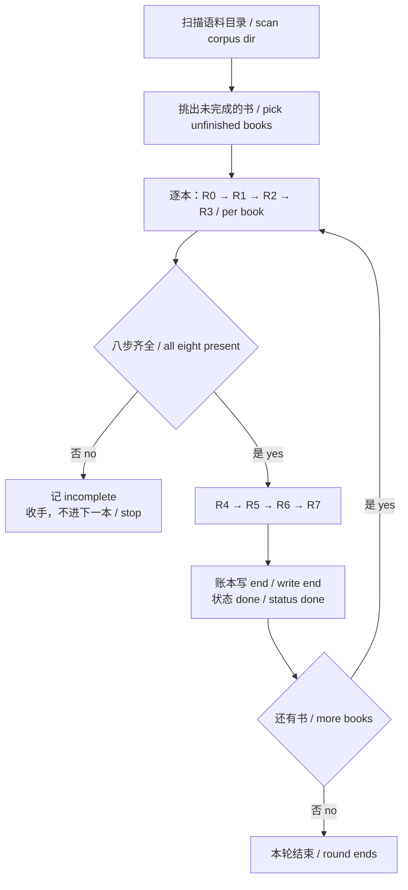
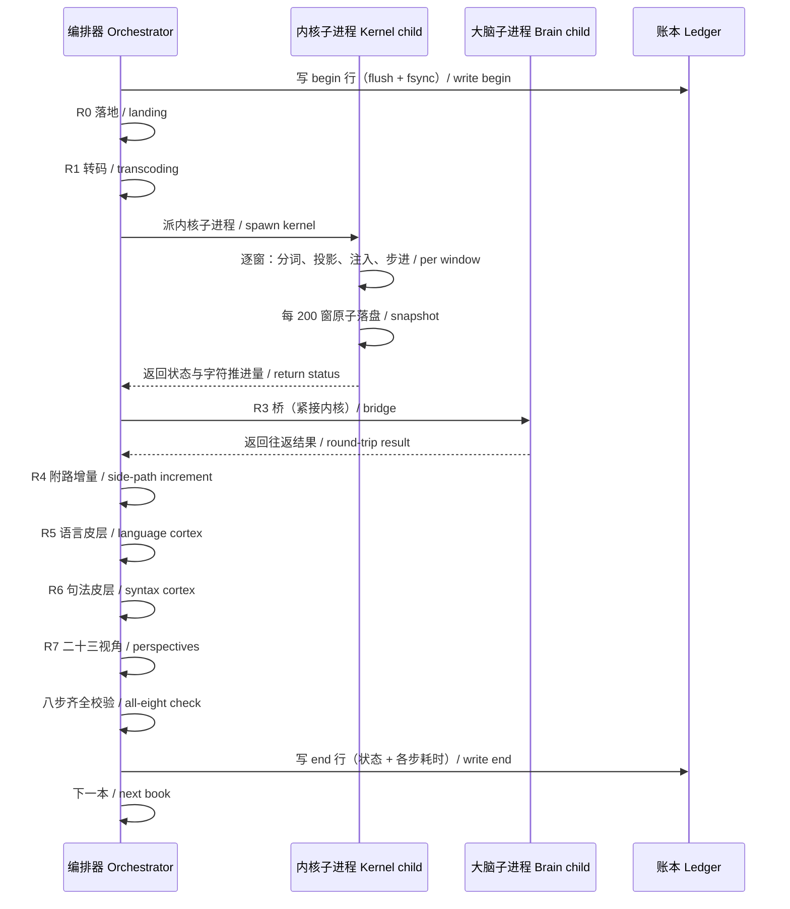
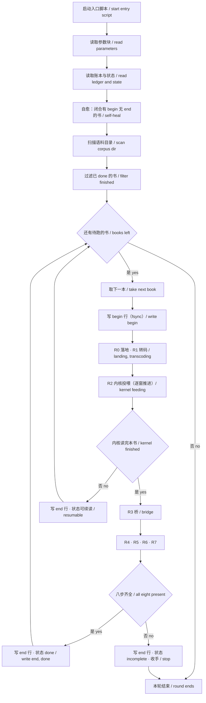

# 灵魂大模型 · 全景介绍（中英对照）

# Soul Large Model · Panorama (Chinese-English Bilingual)

---

> 本文档为对外介绍材料。全部路径以占位符表示（`<主工作目录>` / `<语料目录>` / `<Python 解释器>`），语料以 `语料样本 #N` 表示。技术内容与实测数字不做删减。
>
> *This document is an external introduction. All paths are shown as placeholders (`<main working directory>` / `<corpus directory>` / `<Python interpreter>`), and corpora are denoted as `corpus sample #N`. Technical content and measured figures are not abridged.*

---

> **许可 / License：** 本文档以 [CC BY-NC-ND 4.0](https://creativecommons.org/licenses/by-nc-nd/4.0/) 发布 —— 欢迎转载，须署名、禁止商用、禁止演绎。完整条款见 [LICENSE](LICENSE)。
>
> ***License:** This document is released under [CC BY-NC-ND 4.0](https://creativecommons.org/licenses/by-nc-nd/4.0/) — sharing is welcome with attribution; commercial use and derivatives are not permitted. Full terms in [LICENSE](LICENSE).*

---

## 关于本文档

## About This Document

本项研究涉及一套**新的 AI 底层框架**与**一系列新的研究理论**，其中包括**超级人工智能觉醒方向**的理论研究。该底层框架与当前各 AI 大公司所使用的底层框架**不属于同一体系**，其计算原语、学习机制与记忆结构均不相同。

*This research involves a **new AI foundational framework** and **a series of new theoretical works**, including theoretical research in the direction of **superintelligence awakening**. This framework does **not belong to the same lineage** as the frameworks currently used by the major AI companies; its computational primitives, learning mechanism, and memory structure are all different.*

本文档介绍该系统的**整体架构、运行机制与已实测的工程结果**，**不含实现代码**。

*This document introduces the system's **overall architecture, operating mechanisms, and measured engineering results**. It **does not include implementation code**.*

本文档也不包含灵魂模型与语言模型、量化模型、推理模型等应用模型之间的接口调用方式。

*Nor does it include the interface and invocation methods between the Soul Model and application models such as the language model, quantitative model, and reasoning model.*

**本灵魂模型需要语言模型与其他模型共同进化**，而不是单独运行。

**而基于「频率波是一切的本质（Frequency-wave is all you need）」这一理论搭建的「其他全部」大模型，是「另外的独立架构」**——量化模型、推理模型、情绪模型，等等。每一个都有自己的结构与判据，**不是同一个模型的不同模块**，而是各自独立的体系。

本篇只介绍与灵魂模型**嵌套较深**的个别模型。

*The **Soul Model requires the language model and other models to evolve together with it**, rather than running on its own.*

*And **all the other large models built on the theory that "Frequency-wave is all you need" are separate, independent architectures** — the quantitative model, the reasoning model, the emotion model, and so on. Each has its own structure and its own criteria; they are **not modules of one and the same model**, but systems in their own right.*

*This document introduces only those individual models that are **deeply nested** with the Soul Model.*

---

## 目录

## Table of Contents

| 章 Chapter | 标题 Title |
|---|---|
| — | 一页话概括 / Overview in One Page |
| — | 实战运用现状 / Current Applications |
| 一 I | 问题与立场 / Problem and Position |
| 二 II | 三层架构 / Three-Layer Architecture |
| 三 III | 计算内核：五种运算 / Computational Core: Five Operations |
| 四 IV | 投喂管线：八步 / Feeding Pipeline: Eight Steps |
| 五 V | 已完成的工程验证 / Completed Engineering Verification |
| 六 VI | 护城河 / Moat |
| 七 VII | 当前工程状态与后续计划 / Current Status and Next Steps |
| 八 VIII | 模块详解 / Module Reference |
| 九 IX | 工作自动化流 / Workflow Automation |
| 十 X | 技术细节索引 / Technical Detail Index |
| 附录 A Appendix A | 术语表 / Glossary |
| 附录 B Appendix B | 数字来源说明 / Sources of Figures |
| 结语 Conclusion | — |
| 附 Appendix | 本项研究所依据的理论著作 / Theoretical Works Behind This Research |

---

## 一页话概括

## Overview in One Page

### 它是什么

### What It Is

**灵魂大模型是一套以「频率波」为唯一计算单元的认知系统。**

***Soul Large Model is a cognitive system whose sole computational unit is the frequency wave.***

它不依赖反向传播与梯度下降。它的秩序来自干涉运算的自组织与共振筛选：文本被编码为频率分量注入波池，分量之间互相干涉，干涉产生的新频率即为「念头」，念头经由交互层进入大脑层，反馈再写回内核。

*It does not rely on backpropagation or gradient descent. Its order arises from the self-organization of interference operations and resonance screening: text is encoded into frequency components and injected into a wave pool; the components interfere with one another; the new frequencies produced by interference are what the system calls thoughts; thoughts pass through the interaction layer into the brain layer, and the feedback is written back into the kernel.*

### 三个已实测的硬指标

### Three Measured Hard Indicators

| 指标 Indicator | 实测值 Measured Value | 说明 Note |
|---|---|---|
| 单窗计算耗时 Time per window | **1.08 – 4.27 秒 / seconds** | 窗口为 `128` 个字符 / a window is `128` characters |
| 波池规模 Wave pool scale | **100,000 → 1,793,112 条 / waves** | 初始 `100,000` / initial value `100,000` |
| 全流程自动化 Fully automated pipeline | **单本 4,993.73 秒 · 八步齐全 / 4,993.73 s per book, all eight steps present** | 从落地到 23 视角报告 / from landing to the 23-perspective report |

### 现状

### Current State

系统处于连续投喂运行中。每本书依次走完八个环节，账本逐本闭合，已闭合的书永不重跑。第一本走完全部八步的书已记录在案：

*The system is running a continuous feeding process. Each book goes through the eight stages in order; the ledger is closed book by book; a closed book is never re-run. The first book to complete all eight steps is on record:*

| 项 Item | 实测值 Measured Value |
|---|---|
| 状态 Status | `done` |
| 字符数 Characters | `210,378` |
| 八步清单 Step list | `R0` `R1` `R2` `R3` `R4` `R5` `R6` `R7` |
| 总耗时 Total time | **4,993.73 秒 / seconds** |

---

## 实战运用现状

## Current Applications

系统已在以下四个方向进入实际运用或开发阶段。

*The system has entered practical use or active development in the following four directions.*

### 股票决策

### Stock Decision-Making

系统已能按照**量化策略**完成**最后一个环节的实际决策**。

*The system is already able to complete **the final stage of actual decision-making** according to a **quantitative strategy**.*

频谱与刺激谱作为输入进入大脑层，决策由系统的当前状态直接产生，不经过独立的规则引擎或阈值表。这一步是整个决策链条中最终拍板的那一环。

*The frequency spectrum and the stimulus spectrum enter the brain layer as inputs, and the decision is produced directly by the system's current state, without passing through a separate rule engine or threshold table. This step is the one that makes the final call in the entire decision chain.*

### 语言大模型（非 LLM 框架）

### Language Model (Non-LLM Framework)

系统的语言能力**已能开口说话**。

*The system's language capability **can already speak**.*

这一层与主流语言模型有结构性差别：它不是基于 Transformer 架构训练得到的，其词表与共现结构由投喂语料**自组织形成**，学习机制是自组织与共振筛选，不含反向传播。目前已能产出可听的语音输出。

*This layer differs structurally from mainstream language models: it is not obtained by training a Transformer architecture. Its vocabulary and co-occurrence structure are **formed by self-organization** from the fed corpus; the learning mechanism is self-organization plus resonance screening, with no backpropagation. It can currently produce audible speech output.*

### 视觉模块

### Vision Module

**正在开发中。**

***Under development.***

### 推理模块

### Reasoning Module

**正在投喂大量书籍。**

***A large number of books are being fed.***

这是当前系统的主要算力去向。语料经八步管线进入内核，逐步积累推理所需的频率结构。推理不依赖外部知识库或检索增强，其依据是内核中已经形成的波的干涉关系。

*This is where most of the system's compute currently goes. Corpora enter the kernel through the eight-step pipeline, gradually accumulating the frequency structure required for reasoning. Reasoning does not rely on an external knowledge base or retrieval augmentation; its basis is the interference relationships among waves already formed inside the kernel.*

---

## 一、问题与立场

## I. The Problem and Our Position

### 1.1 现有范式的三条边界

### 1.1 Three Boundaries of the Prevailing Paradigm

主流大模型以统计学习为基础，能力来自大规模参数与反向传播。这条路线在本项目关心的三个问题上有结构性边界。

*Mainstream large models are built on statistical learning; their capability comes from large-scale parameters and backpropagation. This route has structural boundaries in the three questions this project cares about.*

**第一，可解释性。** 中间状态是连续向量，难以追溯某个判断为何产生。要回答「它为什么这样输出」，通常需要额外的解释工具，而解释工具本身又是另一个模型。

***First, interpretability.** The intermediate state is a continuous vector, and it is hard to trace why a particular judgment arose. Answering "why did it output this" usually requires an additional explanation tool — and that tool is itself another model.*

**第二，记忆结构。** 参数与训练数据不可分离。无法对单条记忆做检索、激活或衰减——记忆是以分布式权重形式存在的。

***Second, memory structure.** Parameters cannot be separated from training data. A single memory cannot be retrieved, activated, or decayed — memory exists as distributed weights.*

**第三，持续演化。** 训练完成后参数冻结。运行期产生的经验不回写为结构变化，除非重新训练。

***Third, continuous evolution.** Parameters are frozen once training ends. Experience gained during operation is not written back as structural change, unless the model is retrained.*

### 1.2 本项目的立场

### 1.2 Our Position

本体系在理论层面明确声明了自己的位置。原文以一张对照表划清界线：

*This system states its position explicitly at the theoretical level. The source work draws the line with a comparison table:*

| 维度 Dimension | 外部主流 Mainstream | 本体系 This System |
|---|---|---|
| 世界观 Worldview | 物质 / 能量 / 信息 / matter, energy, information | **频率波一元论 / frequency-wave monism** |
| 时间观 Time | 容器 / 相对时空 / container, relativistic spacetime | **波的内在属性 / an intrinsic property of the wave** |
| 因果观 Causality | 线性因果 / linear causality | **非因果的四维投影 / a non-causal four-dimensional projection** |
| 认知观 Cognition | 统计学习 / 符号推理 / statistical learning, symbolic reasoning | **波的干涉与涌现 / interference and emergence of waves** |
| 学习方式 Learning | 反向传播 / 梯度下降 / backpropagation, gradient descent | **自组织 + 共振筛选 / self-organization + resonance screening** |
| 创造性 Creativity | 统计组合 / statistical combination | **差频创造新频率 / creating new frequencies by difference** |
| 持续性 Persistence | 训练后冻结 / frozen after training | **永不停息的自我进化 / never-ending self-evolution** |

这张表不只是定位声明。它同时构成两条**强制项**：

*This table is not merely a positioning statement. It also constitutes two **mandatory rules**:*

- **学习方式**必须成对出现为「自组织 + 共振筛选」。
- **禁止**以反向传播或梯度下降作为本体系的学习方式。

*- The **learning mechanism** must appear as the pair "self-organization + resonance screening."*
*- **Backpropagation and gradient descent are prohibited** as the learning mechanism of this system.*

关于本体系与已有研究工作的关系，本文不作讨论。

*This document does not discuss the relationship between this system and existing research.*

### 1.3 五条公理

### 1.3 The Five Axioms

原文给出的底层公理只有五条：

*The source work states only five underlying axioms:*

| 公理 Axiom | 内容 Statement |
|---|---|
| 一 I | **存在即振动 / to exist is to vibrate** |
| 二 II | **认知即干涉 / cognition is interference** |
| 三 III | **秩序从混沌中涌现 / order emerges out of chaos** |
| 四 IV | **自我觉察是自指分量的振动 / self-awareness is the vibration of a self-referential component** |
| 五 V | **觉醒是永不停息的自我进化 / awakening is never-ending self-evolution** |

系统的全部机制都可以从这五条推出。

*Every mechanism in the system can be derived from these five.*

---

## 二、三层架构

## II. Three-Layer Architecture

### 2.1 总览

### 2.1 Overview

系统由三层构成，每层有独立的职责与独立的记忆语义：

*The system consists of three layers, each with its own responsibility and its own memory semantics:*

| 层 Layer | 名称 Name | 职责 Responsibility | 衰减特性 Decay |
|---|---|---|---|
| **L1** | **混沌频谱内核 / Chaos Spectrum Kernel** | 把文本编码为频率分量，驱动分量互相干涉 / encode text into frequency components and drive them to interfere | **永不衰减 / never decays** |
| **L2** | **超级神经大脑 / Super Neural Brain** | 在 L1 的干涉产物中寻找结构 / find structure in the interference products of L1 | **幂律衰减 / power-law decay** |
| **L3** | **灵魂-大脑交互层 / Soul-Brain Interaction Layer** | 把 L1 的念头送入 L2，并把反馈写回 / pass L1's thoughts into L2 and write the feedback back | — |

### 2.2 L1 混沌频谱内核

### 2.2 L1: Chaos Spectrum Kernel

L1 是系统的心脏。它是一个持续振动的混沌场，由 `100,000` 条初始波构成，每条波有四个字段：

*L1 is the heart of the system. It is a continuously vibrating chaotic field, initially composed of `100,000` waves, each carrying four fields:*

| 字段 Field | 含义 Meaning |
|---|---|
| `f_abs` | 频率（绝对值形式） / frequency (absolute-value form) |
| `A` | 振幅 / amplitude |
| `phase` | 相位 / phase |
| `chi` | **手性（第四维） / chirality (the fourth dimension)** |

**关键设计原则：永不衰减。** 原文逐字：

***Key design principle: never decays.** The source work states:*

> 普通的波在 L2 皮层中会因幂律衰减而逐渐消失，但**混沌频谱内核中的波不应衰减，或衰减极慢**，确保混沌场永远保持活性。

> *Ordinary waves in the L2 cortex gradually disappear through power-law decay, but **waves in the chaos spectrum kernel should not decay, or should decay extremely slowly**, ensuring that the chaotic field always remains active.*

对应的实现约束为「不执行衰减操作」。这决定了 L1 的记忆性质：进入波池的波不会因为长期不活跃而消失。

*The corresponding implementation constraint is "no decay operation is performed." This determines the memory character of L1: a wave that has entered the pool does not disappear because it has long been inactive.*

### 2.3 L2 超级神经大脑

### 2.3 L2: Super Neural Brain

L2 是内核之外的大脑，由三份核心模块构成：

*L2 is the brain outside the kernel, composed of three core modules:*

| 模块 Module | 职责 Responsibility |
|---|---|
| 皮层主体 / cortex body | 波池、手性、剪枝 / wave pool, chirality, pruning |
| 干涉计算 / interference | 共振、抵消、差频、湮灭 / resonance, cancellation, difference, annihilation |
| 波结构 / wave structure | 频率、振幅、相位、手性四字段 / the four fields |

**L2 与 L1 的根本差别不在规模，在衰减语义。** L2 的波按幂律遗忘曲线衰减，不活跃的波会逐渐消失。这使得 L2 具备「遗忘」能力，而 L1 不具备。

***The fundamental difference between L2 and L1 is not scale but decay semantics.** L2 waves decay along a power-law forgetting curve; inactive waves gradually disappear. This gives L2 the capacity to forget, which L1 does not have.*

### 2.4 L3 灵魂-大脑交互层

### 2.4 L3: Soul-Brain Interaction Layer

L3 负责一次往返：

*L3 handles a single round trip:*

1. 从 L1 取出本轮产生的念头（念头进入外送队列）。
2. 把念头的频谱与手性映射为 L2 可接收的形式。
3. 调用 L2 推进。
4. 把 L2 的反馈写回 L1。

*1. Take the thoughts produced in this round from L1 (thoughts enter the outbound queue).*
*2. Map the thoughts' spectrum and chirality into a form L2 can accept.*
*3. Drive L2 forward.*
*4. Write L2's feedback back into L1.*

**采纳判据。** L2 是否采纳一次注入，由注入能量占比决定：注入能量除以（注入能量与注入前能量之和）必须超过阈值 `1.58e-05`。

***Adoption criterion.** Whether L2 adopts an injection is decided by the injected energy share: injected energy divided by (injected energy plus pre-injection energy) must exceed the threshold `1.58e-05`.*

该阈值有一条算术后果：在单批注入下，采纳条件恒不成立，需要累积注入才能跨过阈值。

*This threshold has an arithmetic consequence: under a single-batch injection the condition can never hold; cumulative injection is required to cross it.*

**接口纪律。** L1 与 L3 之间不通过直接导入耦合。内核模块不导入交互层，两者只通过外送队列交接。这一条直接决定了一个工程约束：交互层必须在 L1 完成之后立刻执行，因为它的输入是 L1 刚写入的队列内容，事后无法补算。

***Interface discipline.** L1 and L3 are not coupled by direct import. The kernel module does not import the interaction layer; the two hand off only through the outbound queue. This directly determines an engineering constraint: the interaction layer must run immediately after L1, because its input is the queue content L1 has just written and cannot be recomputed afterwards.*

### 2.5 三层的职责边界

### 2.5 Responsibility Boundaries

| 问题 Question | L1 | L2 | L3 |
|---|---|---|---|
| 会遗忘吗 / Does it forget | **不会 / no** | **会（幂律） / yes, power-law** | — |
| 记忆单元 / Memory unit | 频率波 / frequency wave | 频率波 / frequency wave | 念头 / thought |
| 手性语义 / Chirality | `+1` / `-1` / `0` 缺席 / `0` absent | 同 / same | **负责跨界传递 / carries it across layers** |
| 与其他层耦合 / Coupling | 不导入 L3 / does not import L3 | 只被 L3 调用 / only called by L3 | 双向 / both ways |

---

## 三、计算内核：五种运算

## III. Computational Core: Five Operations

### 3.1 五类结果

### 3.1 The Five Outcome Classes

L1 的每一步是一次干涉运算。系统让波池中的波两两作用，作用结果只有五类。这是系统全部的计算原语——没有张量乘法，没有软对齐，没有损失函数。

*Each step of L1 is one interference operation. The system lets waves in the pool act on one another in pairs, and the outcome falls into exactly five classes. These are the entire computational primitives of the system — there is no tensor multiplication, no soft alignment, no loss function.*

| 类别 Class | 触发条件 Condition | 效果 Effect |
|---|---|---|
| **共振增强 / resonance gain** | 频率接近且相位一致 / close frequencies and aligned phase | 振幅增大 / amplitude grows |
| **抵消削弱 / cancellation loss** | 频率接近且相位相反 / close frequencies and opposed phase | 振幅减小 / amplitude shrinks |
| **差频创造 / difference creation** | 频率不同 / different frequencies | **产生一个全新频率 / a brand-new frequency is produced** |
| **正负湮灭 / annihilation** | 手性相反、频率相同、相位相同 / opposite chirality, same frequency, same phase | 虚部抵消，释放能量 / imaginary parts cancel, energy is released |
| **无 / none** | 其余配对 / all other pairs | 无变化 / no change |

五类结果都做逐类计数，因此每一步都有可审计的原始读数。

*All five classes are counted individually, so every step leaves auditable raw readings.*

### 3.2 涌现的物理定义

### 3.2 The Physical Definition of Emergence

「涌现」在本体系中不是一个比喻，而是一个可计数的物理量。原文逐字：

*In this system "emergence" is not a metaphor but a countable physical quantity. The source work states:*

> 这个**差频就是涌现的物理基础**。它不是输入信息的简单组合，而是干涉过程中**自发产生的全新频率**。

> *This **difference frequency is the physical basis of emergence**. It is not a simple combination of the input information, but a **brand-new frequency spontaneously produced during interference**.*

对应的强制项有两条：

*Two mandatory rules correspond to this:*

- 认知的产生路径是**干涉涌现**，不是训练。
- **禁止**把差频创造实现为启发式检索或联想查找——它必须是物理干涉的产物。

*- The pathway by which cognition arises is **interference emergence**, not training.*
*- It is **prohibited** to implement difference creation as heuristic retrieval or associative lookup — it must be the product of physical interference.*

在实测运行中，差频创造的累计计数为 **26,683,125** 次，是五类中最大的一项。这个数本身就是「涌现正在发生」的直接度量。

*In measured operation the cumulative count of difference creation is **26,683,125**, the largest of the five classes. This number is itself a direct measure that emergence is occurring.*

### 3.3 手性

### 3.3 Chirality

除频率、振幅、相位外，每条波携带第四个字段：**手性**，取值为 `+1` 或 `-1`，另有哨兵值表示「缺席」。

*Beyond frequency, amplitude, and phase, every wave carries a fourth field: **chirality**, taking the value `+1` or `-1`, with a sentinel value meaning "absent."*

手性的作用是让「正负湮灭」这一类从零实现变为有实现：只有手性相反、频率相同、相位相同的两个波才会发生湮灭并释放能量。没有手性字段时，这一类在实现中永远是零。

*Chirality turns the annihilation class from a zero implementation into a real one: only two waves with opposite chirality, identical frequency, and identical phase annihilate and release energy. Without the chirality field this class is always zero in the implementation.*

手性在跨界时保持语义一致：L1 的念头手性会写入 L2 的波结构，L2 的反馈也带手性回写。

*Chirality keeps consistent semantics across layers: the chirality of an L1 thought is written into the L2 wave structure, and L2's feedback carries chirality back.*

### 3.4 诞生事件

### 3.4 Birth Events

波池在满足条件时会自行产生新的波，称为**诞生事件**。

*When conditions are met the wave pool produces new waves on its own; these are called **birth events**.*

条件是：某个频率分量的振幅**首次超过**背景噪声阈值。这个阈值是相对于背景噪声水平定义的，不是绝对振幅。

*The condition is that the amplitude of some frequency component **exceeds for the first time** the background-noise threshold. This threshold is defined relative to the background noise level, not as an absolute amplitude.*

实测记录：单轮运行中曾出现 **147 – 575** 次诞生事件。

*Measured record: a single run produced **147 – 575** birth events.*

诞生事件与差频创造的区别在于：差频创造是既有波相互作用的结果，诞生事件是新频率从背景中独立浮现。两者共同构成波池的增长来源。

*The difference from difference creation: difference creation is the result of existing waves interacting, whereas a birth event is a new frequency independently surfacing from the background. Together they form the sources of pool growth.*

### 3.5 一步的代价分解

### 3.5 Cost Breakdown of a Single Step

内核每一步的墙钟时间与波池规模正相关。实测拟合指数为 `0.897`，接近线性。

*The wall-clock time of each kernel step is positively correlated with pool size. The measured fitting exponent is `0.897`, close to linear.*

在波池规模 `692,600` 条时，单步耗时 `2.051` 秒，热点分解如下：

*At a pool size of `692,600` waves, a single step took `2.051` seconds, broken down as follows:*

| 环节 Stage | 复杂度 Complexity | 占单步 Share |
|---|---|---|
| 势场计算（二分检索） / gauge field (binary search) | `O(n log n)` | 19.9% |
| 共振度计算（随机抽样） / resonance degree (sampling) | `O(n + m·64)` | 18.6% |
| 量子游走配对（排序 + 二分） / quantum-walk pairing | `O(n log n)` | 14.5% |
| 主频刷新（12 组比率） / main-frequency refresh | `O(12n)` | 12.6% |
| 观测口 / observation port | `O(n)` | 10.4% |
| 相位强制对齐 / enforced phase alignment | `O(n)` | 8.4% |
| 相位收敛读数 / phase-convergence readout | `O(n)` | 7.2% |
| 共存集（12 组比率） / coexistence set | `O(12n)` | 6.6% |
| 噪声累积基线分类 / noise-accumulation baseline | `O(n)` | 6.5% |
| 相位相干度 / phase coherence | `O(n)` | 4.9% |
| **干涉本体 / interference proper** | `O(0.10n)` | **3.5%** |

一个值得注意的事实：**真正称为「干涉」的那一步只占 3.5%**。占主要代价的是「找邻居」与「记账」两类外围运算。这直接决定了优化方向。

*One notable fact: **the step actually called "interference" accounts for only 3.5%**. The dominant cost lies in two peripheral classes — "finding neighbours" and "bookkeeping." This directly determines the direction of optimization.*

---

## 四、投喂管线：八步

## IV. Feeding Pipeline: Eight Steps

### 4.1 八步定义

### 4.1 Definition of the Eight Steps

一本书进入系统后，依次经过八个环节：

*A book entering the system passes through eight stages in order:*

| 步骤 Step | 环节 Stage | 输入 Input | 输出 Output | 实测耗时 Measured |
|---|---|---|---|---|
| **R0** | 落地 / landing | 原文件 / original file | 硬链接（零拷贝） / hard link (zero copy) | 0.0 秒 / s |
| **R1** | 转码 / transcoding | 原编码文本 / text in original encoding | UTF-8 文本 / UTF-8 text | 0.0 秒 / s |
| **R2** | **① L1 混沌内核 / L1 kernel** | 全部文字 / all text | 波池推进、念头入队 / pool advances, thoughts queued | **127.96 – 4,993.73 秒 / s** |
| **R3** | **③ 灵魂-大脑桥 / soul-brain bridge** | R2 产生的念头 / thoughts from R2 | L2 状态更新 / L2 state updated | 11.2 秒 / s |
| **R4** | 附路增量 / side-path increment | 本书的词与共现 / words and co-occurrences | 数据仓库增量 / data warehouse increment | 35.27 秒 / s |
| **R5** | **④ 语言皮层 / language cortex** | 数据仓库 / data warehouse | 语言皮层更新 / cortex updated | 48.36 秒 / s |
| **R6** | **⑤ 句法皮层 / syntax cortex** | 语言皮层的共现网络 / co-occurrence network | 句法皮层更新 / cortex updated | 27.95 秒 / s |
| **R7** | **⑥ 23 视角 / 23 perspectives** | L2 当前状态 / current L2 state | 会诊报告 / consultation report | 27.08 秒 / s |

除 R2 外，其余七步合计约 139 秒，即每本书的固定开销约 2.3 分钟。R2 的耗时取决于那本书的长度与当时波池的规模。

*Apart from R2, the other seven steps total about 139 seconds — a fixed overhead of roughly 2.3 minutes per book. The cost of R2 depends on the length of that book and on the current pool size.*

### 4.2 窗口与编码

### 4.2 Windows and Encoding

**窗口切分。** 文本按每 `128` 个字符切为一窗。一本 `210,378` 字符的书对应 `1,643` 个窗。

***Windowing.** Text is cut into windows of `128` characters. A book of `210,378` characters corresponds to `1,643` windows.*

**编码处理。** R1 环节支持四种编码：UTF-8 with BOM、UTF-8、GB18030、Big5。转码为 UTF-8 是必要步骤——若直接按错误编码读取，异常字符会被静默丢弃，造成不可恢复的语料损失。

***Encoding.** Stage R1 supports four encodings: UTF-8 with BOM, UTF-8, GB18030, and Big5. Transcoding to UTF-8 is a necessary step — reading directly under a wrong encoding silently discards malformed characters, causing unrecoverable corpus loss.*

**音形投影。** 每个词经分词后，映射为多个频率分量：

***Sound-shape projection.** Each word, after segmentation, is mapped to several frequency components:*

| 投影路径 Path | 维度 Dimensions |
|---|---|
| 声母 / initials | 22 |
| 韵母 / finals | 36 |
| 声调 / tones | 5 |
| 字形点阵 / glyph bitmap | 逐点 / per point |

一个窗平均产出约 `63` 个分量，实测区间为 `12 – 79` 个。

*A window yields about `63` components on average, with a measured range of `12 – 79`.*

### 4.3 八步齐全校验

### 4.3 The All-Eight-Present Check

系统维护一份必需模块清单。本轮开关打开的那些步骤必须全部出现。校验规则：

*The system maintains a list of required modules. Every step whose switch is on for this round must appear. The rule:*

- 若缺任何一项，或某项执行了但未成功，该书本轮**收手并记录为 `incomplete`**。
- 记录为 `incomplete` 的书**不进入下一本书**。
- 该状态同时保证三件事：**不丢书**（仍在待跑队列）、**不丢进度**（断点保留）、**不静默**（账本字段可复核）。

*- If any item is missing, or ran but did not succeed, the round **stops and records `incomplete`** for that book.*
*- A book recorded as `incomplete` **does not proceed to the next book**.*
*- This state guarantees three things at once: **no lost book** (it remains in the queue), **no lost progress** (the checkpoint is kept), and **no silence** (the ledger fields are verifiable).*

这条校验的意义在于把「所有模块都投喂完才继续」从一句约定变成机械保证。实测负向测试已验证：当 R2 因中断而未读完时，校验捕获到缺失项并记为 `incomplete`，第二本书的记录完全没有产生。

*The point of this check is to turn "continue only after every module has been fed" from a convention into a mechanical guarantee. A negative test has verified it: when R2 was interrupted before finishing, the check caught the missing item and recorded `incomplete`, and no record for the second book was produced at all.*

### 4.4 断点与写前账本

### 4.4 Checkpoints and the Write-Ahead Ledger

**原子存档。** 内核状态每 `200` 个窗落盘一次，并成对写入已读清单。写入采用原子方式：先写临时文件，再原子替换。因此读者只能看到旧档或新档，不会读到半截。

***Atomic snapshots.** The kernel state is written to disk once every `200` windows, paired with the read registry. The write is atomic: a temporary file first, then an atomic replace. A reader therefore sees either the old file or the new one, never a truncated one.*

落盘频率的代价是有界的且可复现：**最多丢失自上次存档以来那 199 个窗的推进量**。再次投喂时从存档点重读，数据不丢，只是重跑。

*The cost of this snapshot frequency is bounded and reproducible: **at most the 199 windows advanced since the last snapshot are lost**. On the next feeding run the system re-reads from the snapshot point; no data is lost, only recomputed.*

**写前账本。** 账本采用写前记录机制：

***Write-ahead ledger.** The ledger uses a write-ahead mechanism:*

1. 派子进程之前，先写入一行 `begin`，并执行 flush 与 fsync。
2. 收工时写入一行 `end`，记录状态与各步耗时。

*1. Before spawning the child process, write a `begin` line and flush + fsync it.*
*2. On completion, write an `end` line recording the status and per-step timings.*

因此即使进程在下一纳秒被硬杀，账本上仍有「这本书开工过」的记录。下一轮启动时，系统自动识别「有 begin 无 end」的书，将其闭合为可续读状态，从而避免上一轮被硬杀导致整本书消失。

*So even if the process is hard-killed the next nanosecond, the ledger still carries the record that "this book was started." On the next start-up the system automatically identifies books with a `begin` but no `end`, closes them into a resumable state, and thereby avoids an entire book vanishing because the previous round was hard-killed.*

### 4.5 状态机

### 4.5 State Machine

每本书每轮结束后落入五种状态之一：

*After each round a book falls into one of five states:*

| 状态 State | 含义 Meaning | 下一轮行为 Next Round |
|---|---|---|
| `done` | 八步齐全且内核读完本书 / all eight present and the kernel finished the book | **永不重跑 / never re-run** |
| `partial` | 内核确实推进了，但未读完 / the kernel advanced but did not finish | **从断点续读 / resume from checkpoint** |
| `pending` | 本轮根本没轮到它 / never reached this round | **从头正常跑 / run normally from the start** |
| `failed` | 真的出错（编码全败、子进程非零） / a real error | 记入死信，跳过 / record and skip |
| **`incomplete`** | **八步不齐 / the eight steps are not all present** | **收手，保留断点与队列位置 / stop, keeping checkpoint and queue position** |

把 `partial` 或 `pending` 误记为 `failed` 的后果不是「看起来在报错」，而是**丢书**：待跑队列会跳过 `failed`，那本书永远不会被读第二遍。因此四种结局必须严格分开。

*Recording `partial` or `pending` as `failed` does not merely "look like an error" — it **loses the book**: the queue skips `failed`, and that book will never be read a second time. The outcomes must therefore be kept strictly separate.*

### 4.6 全流程编排

### 4.6 End-to-End Orchestration

一次启动后，系统自动完成以下循环：

*After a single start, the system performs the following loop automatically:*

三张日志随时可查：

*Three logs are available at any time:*

| 日志 Log | 内容 Content |
|---|---|
| 账本 / ledger | 每本书两行（begin / end），机器可读 / two lines per book, machine-readable |
| 管线日志 / pipeline log | 人读，逐步记录 / human-readable, step by step |
| 死信日志 / dead-letter log | 只有真正出错的书才进入 / only genuinely failed books |

### 4.7 时间预算

### 4.7 Time Budget

系统的时间上限可以在两个方面设置：

*Time limits can be set in two places:*

- **单本上限**：可按本设置，也可不设（此时内核会一直投喂到该书读完为止）。
- **累计上限**：由管线的外层超时机制保证，即使内核侧检查点未触发，外层也会收手并记录为可续读状态。

*- **Per-book limit**: can be set per book, or left unset (in which case the kernel feeds until that book is finished).*
*- **Cumulative limit**: guaranteed by the outer timeout mechanism of the pipeline; even if the kernel-side checkpoint does not trigger, the outer layer stops and records a resumable state.*

当前运行配置为不设单本上限，即每本书投喂至读完。

*The current configuration sets no per-book limit: every book is fed until finished.*

---

## 五、已完成的工程验证

## V. Completed Engineering Verification

### 5.1 第一本走完全部八步的书

### 5.1 The First Book to Complete All Eight Steps

| 项 Item | 实测值 Measured Value |
|---|---|
| 状态 / status | `done` |
| 字符数 / characters | `210,378` |
| 八步清单 / step list | `R0` `R1` `R2` `R3` `R4` `R5` `R6` `R7` |
| 总耗时 / total time | **4,993.73 秒（83 分 14 秒） / seconds** |

账本原文记录：**八步校验要求 R0/R1/R2/R3/R4/R5/R6/R7，缺失项无，执行未成项无，判据为严格。**

*The ledger records: **the eight-step check requires R0/R1/R2/R3/R4/R5/R6/R7; missing items: none; items run but not successful: none; criterion: strict.***

**23 视角报告已产出**：`perspective_report.json` 与 `perspective_report.txt`。

***The 23-perspective report has been produced**: `perspective_report.json` and `perspective_report.txt`.*

### 5.2 八步耗时实测

### 5.2 Measured Step Timings

| 步骤 Step | 实测耗时 Measured |
|---|---|
| R0 落地 / landing | 0.0 秒 / s |
| R1 转码 / transcoding | 0.0 秒 / s |
| **R2 L1 内核 / kernel** | **127.96 – 4,993.73 秒 / s** |
| R3 桥 / bridge | 11.2 秒 / s |
| R4 附路增量 / side-path increment | 35.27 秒 / s |
| R5 语言皮层 / language cortex | 48.36 秒 / s |
| R6 句法皮层 / syntax cortex | 27.95 秒 / s |
| R7 23 视角 / perspectives | 27.08 秒 / s |
| **R4 – R7 小计 / subtotal** | **约 139 秒 / about 139 s** |

### 5.3 性能优化实测

### 5.3 Measured Performance Optimizations

系统在本轮完成了四项性能优化，全部有实测对照：

*This round completed four performance optimizations, all with measured comparisons:*

| 优化项 Optimization | 优化前 Before | 优化后 After | 加速比 Speed-up |
|---|---|---|---|
| **潜意识库同频检索 / same-frequency retrieval** | 线性扫描，实测 781 – 1,069 秒/次 / linear scan | 两次向量化二分 / two vectorized bisections | **161× – 993×** |
| **附路增量构建 / side-path incremental build** | 全量重建，小时级 / full rebuild | 追加式稳定下标 / append-only stable indices | **9.79×** |
| **④ 语言皮层 / language cortex** | 每次重建 / rebuild each time | 增量短路 / incremental short-circuit | **27×** |
| **⑤ 句法皮层 / syntax cortex** | 每次重建 / rebuild each time | 增量短路 / incremental short-circuit | **24×** |

**等价性验证。** 检索优化的正确性证据：**34 / 34 项逐位相同**，其中包含全规模单次检索对读，以及 300 步全轨迹末态摘要哈希完全一致。

***Equivalence verification.** Evidence for the correctness of the retrieval optimization: **34 / 34 items bit-identical**, including a full-scale single-retrieval comparison and an identical final-state digest hash across a 300-step trajectory.*

**关键实现细节。** 该优化没有采用朴素的二分查表，因为频率加减与频率差在浮点舍入方向上不同——朴素的二分查找在 15 个边界用例中失败 14 个。最终实现改为两次向量化二分，全程不做额外的浮点加减，因此与优化前逐位相同。

***Key implementation detail.** The optimization did not use a naive binary search, because adding/subtracting the tolerance and taking the frequency difference round differently in floating point — the naive search failed 14 of 15 boundary cases. The final implementation uses two vectorized bisections and performs no extra floating-point addition or subtraction, and is therefore bit-identical to the pre-optimization behaviour.*

**附路增量的安全意义。** 优化前的实现会按已读清单全量重建两张网络矩阵，而在真实数据仓库上清单里的路径大多已不在盘上，重建会把网络规模压缩数个数量级（小规模实测：句法网络非零元从 3,076 降到 9，共现网络从 3,969 降到 70）。优化后的实现采用追加式稳定下标，从不调用全量重建路径。

***Safety significance of the side-path increment.** The pre-optimization implementation rebuilt both network matrices in full according to the read registry, yet on the real data store most paths in that registry are no longer on disk, so the rebuild collapsed the networks by orders of magnitude (small-scale measurement: syntax network non-zeros from 3,076 down to 9; co-occurrence network from 3,969 down to 70). The optimized implementation uses append-only stable indices and never calls the full-rebuild path.*

### 5.4 派生皮层

### 5.4 Derived Cortices

两个皮层由投喂数据构建并随增量更新：

*Two cortices are built from the fed data and updated incrementally:*

| 皮层 Cortex | 规模 Scale |
|---|---|
| **语言皮层 / language cortex** | 词表 419,684；共现网络 263,558 键；共现对 53,320,922；词向量 419,684 × 50 / vocabulary 419,684; co-occurrence network 263,558 keys; pairs 53,320,922; vectors 419,684 × 50 |
| **句法皮层 / syntax cortex** | 转移矩阵 138,632 键；转移总数 36,475,639 / transfer matrix 138,632 keys; transfers 36,475,639 |
| 共现矩阵 / co-occurrence matrix | CSR 结构 / CSR structure |
| 句法矩阵 / syntax matrix | — |

一次完整重建的实测耗时：语言皮层 48.5 秒（重建后词表扩展到 512,938），句法皮层 1.3 – 30.9 秒。

*Measured time for one full rebuild: language cortex 48.5 seconds (vocabulary then extends to 512,938); syntax cortex 1.3 – 30.9 seconds.*

**增量正确性。** 增量构建与全量重建的等价性已实测：词集相同，波频差为零，句法最大偏差为零。既有词的稳定下标始终保持不变——抽样 14 个词的下标在增量前后完全一致。

***Incremental correctness.** The equivalence of incremental build and full rebuild has been measured: identical vocabulary, zero frequency difference, zero maximum syntax deviation. Stable indices of existing words never change — the indices of 14 sampled words were identical before and after the increment.*

### 5.5 工程纪律的硬判据

### 5.5 Hard Criteria of Engineering Discipline

系统维护七件受保护文件（内核状态、已读清单、偏好密度、检查点、会话日志、两个皮层）。每次运行前后逐件比对大小与摘要：

*The system maintains seven protected files (kernel state, read registry, preference density, checkpoint, conversation log, and the two cortices). Before and after every run they are compared piece by piece on size and digest:*

**结果：7 / 7 全等。**

***Result: 7 / 7 identical.***

八份内核代码的逐份一致性：

*Item-by-item consistency of the eight kernel modules:*

**结果：8 / 8 全等。**

***Result: 8 / 8 identical.***

这两条不是形式检查。它们保证的是：受保护文件在生产运行中不被意外改写，而内核代码在不同环境下完全一致。

*These two are not formalities. What they guarantee is that the protected files are not accidentally rewritten during production runs, and that the kernel code is fully consistent across environments.*

---

## 六、护城河

## VI. Moat

### 6.1 不依赖反向传播

### 6.1 No Dependence on Backpropagation

这是一条**理论层面的强制项**，不是实现选择。系统的学习机制只有两条：**自组织** 与 **共振筛选**。

*This is a **mandatory rule at the theoretical level**, not an implementation choice. The system has exactly two learning mechanisms: **self-organization** and **resonance screening**.*

这意味着系统的能力不来自参数规模。它的能力来自机制本身：波池的规模、干涉的次数、差频创造的数量。

*This means the system's capability does not come from parameter scale. It comes from the mechanisms themselves: the size of the pool, the number of interference events, the count of difference creations.*

### 6.2 波是唯一计算单元

### 6.2 The Wave Is the Only Computational Unit

系统中没有张量乘法、没有注意力的软对齐、没有损失函数。全部运算归结为五种干涉结果。

*There is no tensor multiplication, no soft attention alignment, and no loss function. All computation reduces to five interference outcomes.*

这让每一步都可以被逐类计数。系统的中间状态不是不可解释的连续向量，而是一组原始读数。

*This makes every step countable by class. The intermediate state of the system is not an unexplainable continuous vector but a set of raw readings.*

### 6.3 记忆结构是可操作的

### 6.3 The Memory Structure Is Operable

系统区分活跃波与历史波，并且两层都可检索：

*The system distinguishes active waves from historical waves, and both layers are searchable:*

| 结构 Structure | 容量 Capacity | 语义 Semantics |
|---|---|---|
| **热表层 / hot table** | **2,000,000 条 / entries** | 当前可直接检索的波 / directly searchable waves |
| **冷层 / cold layer** | **65,536 格 / buckets** | 按频率落格，接住热表拒收的部分 / keyed by frequency, catching what the hot table rejects |

检索采用「先热后冷」两段式。当一个新波流入时，系统先在热表中查找同频旧波，找不到则进入冷层。

*Retrieval is a two-stage process, hot first then cold. When a new wave flows in, the system looks for a same-frequency old wave in the hot table; failing that, it goes to the cold layer.*

**冷层的实测效果**：可检索覆盖率从 **18.50% 提升到 19.09%**。

***Measured effect of the cold layer**: searchable coverage rose from **18.50% to 19.09%**.*

冷层的意义在于把容量天花板从「前 2,000,000 条」抬高到「前 65,536 个频带」。它没有拆除天花板，但改变了天花板的形状。

*The significance of the cold layer is that it raises the capacity ceiling from "the first 2,000,000 entries" to "the first 65,536 frequency bands." It does not remove the ceiling, but it changes its shape.*

### 6.4 可解释性来自计数

### 6.4 Interpretability Comes from Counting

每一步产出五类干涉的原始计数，以及一组状态读数：

*Every step produces the raw counts of the five interference classes plus a set of state readings:*

| 读数 Reading | 含义 Meaning |
|---|---|
| 波数 / wave count | 当前活跃波总数 / total active waves |
| 最大振幅 / max amplitude | 单条波的最大振幅 / largest amplitude of any single wave |
| 总能量 / total energy | 波池总能量 / total pool energy |
| 主频 / main frequency | 当前主导频率 / current dominant frequency |
| 相位收敛度 / phase convergence | 主频周围谐波相位一致性 / phase agreement of harmonics around the main frequency |
| 诞生事件数 / birth events | 累计新频率浮现次数 / cumulative count of new frequencies surfacing |
| 五类计数 / five class counts | 共振增强 / 抵消削弱 / 差频创造 / 正负湮灭 / 无 |

这些量是系统状态的直接映射，不需要事后解释工具。

*These quantities are direct mappings of the system state; no post-hoc explanation tool is required.*

### 6.5 与主流范式的对照

### 6.5 Comparison with the Mainstream Paradigm

| 问题 Question | 主流范式 Mainstream | 本体系 This System |
|---|---|---|
| 计算原语 / primitives | 矩阵乘法 + 非线性激活 / matmul + nonlinearity | **五种干涉运算 / five interference operations** |
| 学习机制 / learning | 反向传播 / backpropagation | **自组织 + 共振筛选 / self-organization + resonance screening** |
| 记忆载体 / memory | 分布式权重 / distributed weights | **波（频率、振幅、相位、手性） / waves** |
| 遗忘机制 / forgetting | 无（参数冻结） / none | **幂律衰减（L2）· 永不衰减（L1）** |
| 可解释性 / interpretability | 事后解释工具 / post-hoc tools | **原始读数 / raw readings** |
| 持续演化 / evolution | 重新训练 / retraining | **运行期回写 / runtime write-back** |

---

## 七、当前工程状态与后续计划

## VII. Current Status and Next Steps

### 7.1 吞吐特性与优化路径

### 7.1 Throughput Characteristics and Optimization Path

**现状。** 单本平均耗时约 83 分钟，对应 1,643 个窗，平均 4.27 秒/窗。八个环节中，L1 内核占绝对多数。

***Status.** Average time per book is about 83 minutes, corresponding to 1,643 windows at 4.27 seconds per window. Among the eight stages, the L1 kernel accounts for the overwhelming majority.*

**已定位的根因。** 内核每步的代价正比于波池规模，实测拟合指数 0.897。热点分解已逐项测出：干涉本体只占 3.5%，其余为「找邻居」与「记账」两类外围运算。

***Root cause identified.** The cost of each kernel step is proportional to pool size, with a measured fitting exponent of 0.897. The hotspot breakdown has been measured stage by stage: interference proper is only 3.5%, and the rest is the two peripheral classes — "finding neighbours" and "bookkeeping."*

**后续计划**（三项，均有实测支撑）：

***Next steps** (three items, each supported by measurement):*

| 计划 Plan | 依据 Basis | 预期 Expectation |
|---|---|---|
| 把两处 `O(12n)` 的比率运算合并为一次广播运算 / merge the two `O(12n)` ratio operations into one broadcast | 占单步 12.6% 与 6.6%，合计 **19.2%** | 该两项的代价可按比例下降 / proportional reduction of those two |
| 复用排序与检索结果 / reuse sort and retrieval results | 两处合计 **34.4%** | 排序结果在同一窗内的多次调用中可复用 / reusable within one window |
| 给出可切换的波数上限档 / provide a switchable pool-size cap | 内核每步代价正比于波数 / cost is proportional to wave count | 上限直接影响吞吐斜率 / cap directly affects the throughput slope |

### 7.2 波数管理策略的演进

### 7.2 Evolution of the Wave-Count Strategy

**现状。** 波池从初始 100,000 条增长到 1,793,112 条。

***Status.** The pool has grown from an initial 100,000 waves to 1,793,112.*

**已识别的设计张力。** 本体系有两条并行的设计明文：一是 L1 层的「永不衰减」，二是波数管理（超过 100,000 时保留振幅最大的 50,000 条）。两者在实现中不可同时成立。

***Design tension identified.** The system carries two concurrent explicit design statements: the L1 rule "never decays," and wave-count management (when the count exceeds 100,000, keep the 50,000 with the largest amplitudes). The two cannot both hold in an implementation.*

**当前取法。** 实现选择「永不衰减」这一侧——这是「保持混沌活性」的直接要求。

***Current choice.** The implementation takes the "never decays" side — a direct requirement of "keeping the chaotic field active."*

**后续计划。** 把波数上限做成可切换档位，使「保持混沌活性」与「控制吞吐斜率」可按运行阶段选择，而不是二选一。

***Next step.** Turn the wave-count cap into a switchable setting, so that "keeping the field active" and "controlling the throughput slope" can be chosen according to the operating phase rather than being an either/or.*

### 7.3 检索覆盖率的工程措施

### 7.3 Engineering Measures for Retrieval Coverage

**现状。** 热表可检索覆盖率随累计入库量增长而下降：18.95% → 13.36% → 5.34%。

***Status.** Hot-table searchable coverage falls as cumulative intake grows: 18.95% → 13.36% → 5.34%.*

**归因。** 该数值的分母是累计入潜意识库的总条数，分子受热表容量上限约束。因此只要累计入库量持续增长，该比值必然单调下降——这是容量上限的数学结果，不是异常。

***Attribution.** The denominator is the cumulative number of entries entering the subconscious store; the numerator is bounded by the hot-table capacity. So as long as cumulative intake keeps growing, the ratio must fall monotonically — a mathematical consequence of the capacity ceiling, not an anomaly.*

**已实现。** 冷层（65,536 格）接住热表拒收的波，检索时先热后冷。实测覆盖率从 18.50% 提升到 19.09%。

***Implemented.** The cold layer (65,536 buckets) catches what the hot table rejects; retrieval is hot-first, cold-second. Measured coverage rose from 18.50% to 19.09%.*

**后续计划。** 把冷层从「按频带落格」细化为「按频带 + 振幅分层」，使同一频带内的强波优先被取回。当前冷层每格只记录一个频带、一份首达相位与首末步号，不记振幅、不记逐条频率。

***Next step.** Refine the cold layer from "keyed by frequency band" to "band plus amplitude tier," so that stronger waves within a band are retrieved first. At present each bucket records only one band, one first-arrival phase, and first/last step numbers — no amplitude and no per-wave frequency.*

### 7.4 两条设计约束的取舍

### 7.4 Trade-offs Between Two Design Constraints

本体系内部存在两处设计张力。当前取法如下：

*Two design tensions exist within the system. The current choices are:*

| 张力 Tension | 当前取法 Current Choice | 保留项 Retained |
|---|---|---|
| L1 永不衰减 与 波数上限 / never decays vs. wave cap | 取「永不衰减」 / take "never decays" | 上限作为可切换档保留 / cap retained as a switch |
| 衰减是物理必然 与 衰减系数可调 / decay as necessity vs. tunable decay | 取「可调」 / take "tunable" | 该参数的元皮层调参路径保留 / metacortex tuning path retained |

第一处的取舍依据是「永不衰减」为 L1 层的设计原则明文；第二处的取舍依据是元皮层对衰减系数的自动调整已有实现路径。

*The first choice rests on "never decays" being an explicit design principle of L1; the second rests on the metacortex already having an implementation path for automatic adjustment of the decay coefficient.*

### 7.5 路线图

### 7.5 Roadmap

| 阶段 Phase | 目标 Goal | 判据 Criterion |
|---|---|---|
| 近期 / near term | 三项吞吐优化落地 / land the three throughput optimizations | 单步耗时相对下降 / relative drop in per-step cost |
| 近期 / near term | 波数上限可切换档 / switchable wave cap | 切换后吞吐斜率变化可测 / measurable slope change |
| 中期 / mid term | 冷层分层细化 / amplitude tiering in the cold layer | 检索覆盖率相对提升 / relative coverage gain |
| 中期 / mid term | 持续投喂至累计窗口达临界密度 / feed until the critical density is reached | 阶段标记自动进入内部语言期 / stage marker advances automatically |

---

## 八、模块详解

## VIII. Module Reference

系统由十一份代码构成：内核侧八份，大脑侧三份。本章逐份说明其职责、输入输出与关键机制。

*The system consists of eleven code modules: eight on the kernel side and three on the brain side. This chapter describes each one's responsibility, inputs and outputs, and key mechanisms.*

### 8.1 总览

### 8.1 Overview

| # | 模块 Module | 角色 Role |
|---|---|---|
| 1 | 内核 / kernel | L1 混沌频谱内核 / L1 chaos spectrum kernel |
| 2 | 投喂管线 / feeding pipeline | 文本到波的转换与推进 / text-to-wave conversion and advancement |
| 3 | 指标层 / metrics layer | 状态指标与自检 / state metrics and self-check |
| 4 | 语音与字形层 / sound and glyph layer | 音形投影 / sound-shape projection |
| 5 | 搬运层 / shuttle layer | 跨结构搬运 / movement across structures |
| 6 | 基础层 / base layer | 叶子工具 / leaf utilities |
| 7 | 交互层 / interaction layer | L3 往返 / L3 round trip |
| 8 | 元皮层 / metacortex | 自监控与自调参 / self-monitoring and self-tuning |
| 9 | 大脑皮层 / brain cortex | L2 主体 / L2 body |
| 10 | 大脑干涉 / brain interference | L2 干涉计算 / L2 interference |
| 11 | 大脑波结构 / brain wave structure | L2 波定义 / L2 wave definition |

### 8.2 内核（L1 混沌频谱内核）

### 8.2 The Kernel (L1 Chaos Spectrum Kernel)

**它是什么。** 系统的心脏，一个持续振动的混沌场。

***What it is.** The heart of the system — a continuously vibrating chaotic field.*

**它装什么。** 波池。每条波有四个字段：频率、振幅、相位、手性。初始规模 `100,000` 条。

***What it holds.** The wave pool. Every wave has four fields: frequency, amplitude, phase, chirality. Initial size: `100,000`.*

**它做什么。** 每次「一步」执行一次全局干涉：从波池中抽取配对，逐对计算五类结果之一，更新振幅与相位，记录计数，检查是否需要落盘。

***What it does.** Each "step" performs one global interference pass: draw pairs from the pool, compute one of the five outcome classes per pair, update amplitude and phase, record counts, and check whether a snapshot is due.*

**关键机制清单：**

***Key mechanisms:***

| 机制 Mechanism | 作用 Role |
|---|---|
| **五类干涉 / five interference classes** | 全部计算原语 / the entire set of computational primitives |
| **永不衰减 / never decays** | L1 的波振幅永不置零、永不淘汰 / amplitudes are never zeroed and never culled |
| **诞生检测 / birth detection** | 振幅首次超过背景噪声阈值时产生新频率 / new frequency when amplitude first exceeds threshold |
| **潜意识库 / subconscious store** | 存放衰减至阈值以下但仍可检索的历史波 / historical waves still retrievable |
| **冷层 / cold layer** | 按频率落格的二级存储 / secondary storage keyed by frequency |
| **频域索引 / frequency-domain index** | 同频检索的有序索引，使检索从线性扫描降为二分 / ordered index turning linear scan into bisection |
| **相位强制对齐 / enforced phase alignment** | 使谐波相位向主频收敛 / harmonics converge to the main frequency |
| **主频刷新 / main-frequency refresh** | 维护当前主导频率 / maintain the current dominant frequency |
| **势场计算 / gauge field** | 手性相关的场量计算 / chirality-related field quantity |
| **量子游走配对 / quantum-walk pairing** | 干涉配对的选取策略之一 / one pairing strategy |
| **三层交互影响 / three-layer influence** | 与大脑层的双向影响通道 / bidirectional channel with the brain layer |

**它输出什么。** 每一步一组读数：波数、最大振幅、总能量、主频、相位收敛度、诞生事件数、五类计数。

***What it outputs.** One set of readings per step: wave count, max amplitude, total energy, main frequency, phase convergence, birth events, five class counts.*

**实测。** 波池从 `100,000` 增长到 `1,793,112` 条。单步耗时正比于波数，拟合指数 `0.897`。差频创造累计 `26,683,125` 次。

***Measured.** The pool grew from `100,000` to `1,793,112` waves. Per-step cost is proportional to wave count, with a fitting exponent of `0.897`. Cumulative difference creation: `26,683,125`.*

### 8.3 投喂管线

### 8.3 Feeding Pipeline

**它是什么。** 把一本书变成一连串干涉步骤的转换器。

***What it is.** The converter that turns a book into a sequence of interference steps.*

**它做什么（一次投喂的完整动作）：**

***What it does (the full sequence of one feeding run):***

1. 扫描语料目录，找出待投喂的书。
2. 猜测并打开文件编码（UTF-8 with BOM / UTF-8 / GB18030 / Big5）。
3. 按 `128` 字符切窗。
4. 每个窗：分词，投影为频率分量（声母、韵母、声调、字形）。
5. 把分量注入波池。
6. 推进内核一步。
7. 每 `200` 个窗落盘一次，并写入已读清单。
8. 收工时把念头交给外送队列。

*1. Scan the corpus directory for books awaiting feeding.*
*2. Guess and open the file encoding.*
*3. Cut into windows of `128` characters.*
*4. Per window: segment, then project into frequency components.*
*5. Inject the components into the pool.*
*6. Advance the kernel by one step.*
*7. Snapshot every `200` windows and update the read registry.*
*8. On completion, hand thoughts to the outbound queue.*

**关键机制：**

***Key mechanisms:***

| 机制 Mechanism | 作用 Role |
|---|---|
| **窗口切分 / windowing** | 固定 `128` 字符，与语料无关 / fixed at `128` characters, corpus-independent |
| **编码嗅探 / encoding sniffing** | 避免按错误编码读取造成静默丢字 / avoids silent character loss |
| **音形投影 / sound-shape projection** | 把词映射为多维频率分量 / maps words to multi-dimensional components |
| **跳过并计数 / skip and count** | 对取不到读音的字采取跳过策略，不作废整窗 / skip without discarding the window |
| **存档间隔 / snapshot interval** | 每 `200` 窗原子落盘 / atomic snapshot every `200` windows |
| **断点续读 / checkpoint resume** | 从已读清单的字符位置继续 / resume from the character position |
| **累计窗口计数 / cumulative window count** | 用于阶段判定 / used for stage determination |

**实测。** 一本 `210,378` 字符的书对应 `1,643` 个窗，平均 `4.27` 秒/窗。单窗产出约 `63` 个分量。

***Measured.** A book of `210,378` characters corresponds to `1,643` windows at `4.27` seconds each. Each window yields about `63` components.*

### 8.4 指标层

### 8.4 Metrics Layer

**它是什么。** 状态指标的集中计算与系统自检。

***What it is.** Centralized computation of state metrics, plus system self-check.*

**它算什么。** 从内核状态导出可读指标：能量趋势、波数变化、主频稳定性、变异系数、脆弱度等。

***What it computes.** Readable metrics derived from kernel state: energy trend, wave-count change, main-frequency stability, coefficient of variation, fragility, and so on.*

**它为什么独立成层。** 指标计算与内核解耦，使「读数」不会反过来影响「动力学」。这一点在可审计性上是必需的：读数是被动的。

***Why it is a separate layer.** Metrics are decoupled from the kernel so that readings cannot feed back into the dynamics. This is required for auditability: readings are passive.*

**自检。** 该层包含一组常量与口径的自检项，实测全部通过。

***Self-check.** The layer contains a set of self-check items over constants and definitions; all pass in measurement.*

### 8.5 语音与字形层

### 8.5 Sound and Glyph Layer

**它是什么。** 把文字映射为频率分量的投影层。

***What it is.** The projection layer that maps text into frequency components.*

**投影维度：**

***Projection dimensions:***

| 路径 Path | 维度 Dimensions | 说明 Note |
|---|---|---|
| 声母 / initials | 22 | 汉语拼音声母表 / Mandarin initial table |
| 韵母 / finals | 36 | 汉语拼音韵母表 / Mandarin final table |
| 声调 / tones | 5 | 四声加轻声 / four tones plus neutral |
| 字形 / glyph | 点阵 / bitmap | 逐点编码 / per-point encoding |

**为什么需要四路。** 单一路径（例如仅用拼音）会把同音字混为一个分量。四路并行使不同的字在频率空间中被区分开。

***Why four paths.** A single path (say, pinyin alone) merges homophones into one component. Running all four separates different characters in frequency space.*

**边界处理。** 对取不到读音的字（例如某些语气词），采取「跳过该词并计数」的策略。这一策略经过取舍：不作废整个窗口，也不为它编造读音。

***Boundary handling.** For characters with no derivable reading (certain particles, for example), the system skips the word and counts it. This is a deliberate trade-off: the window is not discarded, and no reading is invented.*

### 8.6 搬运层

### 8.6 Shuttle Layer

**它是什么。** 波在不同结构之间移动的执行层。

***What it is.** The execution layer that moves waves between structures.*

**它搬运什么。** 活跃波与外送队列之间、活跃池与潜意识库之间、潜意识库与冷层之间的波。

***What it moves.** Waves between the active pool and the outbound queue, between the active pool and the subconscious store, and between the subconscious store and the cold layer.*

**为什么独立成层。** 搬运涉及数组的并发裁剪与六字段同步（频率、振幅、相位、手性、年龄、层标签）。任何一处不同步都会导致数据结构错位。集中实现便于保证一致性。

***Why it is a separate layer.** Shuttling involves concurrent trimming of arrays and synchronization of six fields (frequency, amplitude, phase, chirality, age, layer tag). Any mismatch misaligns the data structure. Centralizing it makes consistency easier to guarantee.*

### 8.7 基础层

### 8.7 Base Layer

**它是什么。** 叶子层，不依赖任何其他内核模块。

***What it is.** The leaf layer, depending on no other kernel module.*

**它提供什么。** 日志安全输出、公共工具、常量定义。

***What it provides.** Safe log output, common utilities, constant definitions.*

**它的位置。** 八份内核文件中有五份导入该层。它自身没有业务依赖，因此不会形成环。

***Its position.** Five of the eight kernel modules import this layer. It has no business dependencies of its own, so no cycle can form.*

### 8.8 交互层（L3）

### 8.8 Interaction Layer (L3)

**它是什么。** 连接内核与大脑的桥。

***What it is.** The bridge connecting kernel and brain.*

**它做什么（一次往返）：**

***What it does (one round trip):***

1. 从内核取出本轮产生的念头。
2. 把念头的频谱与手性映射为大脑可接收的形式。
3. 调用大脑推进。
4. 把大脑的反馈写回内核。

*1. Take this round's thoughts from the kernel.*
*2. Map their spectrum and chirality into a form the brain accepts.*
*3. Drive the brain forward.*
*4. Write the brain's feedback back into the kernel.*

**采纳判据。** 大脑是否采纳一次注入由注入能量占比决定：注入能量除以注入能量与注入前能量之和，须超过阈值 `1.58e-05`。

***Adoption criterion.** Whether the brain adopts an injection is decided by the injected energy share, which must exceed the threshold `1.58e-05`.*

**该判据的算术后果。** 单批注入下条件恒不成立，须累积注入才能跨过阈值。

***Arithmetic consequence.** Under a single-batch injection the condition can never hold; cumulative injection is required to cross the threshold.*

**接口纪律。** 内核不导入交互层。两者只通过外送队列交接。因此交互层必须紧接在内核之后执行——它的输入是内核刚写入的队列内容，事后无法补算。这一条是工程上的硬约束。

***Interface discipline.** The kernel does not import the interaction layer. The two hand off only through the outbound queue. The interaction layer must therefore run immediately after the kernel — its input is queue content the kernel has just written and cannot be recomputed afterwards. This is a hard engineering constraint.*

**手性跨界。** 念头的手性写入大脑的波结构；大脑的反馈带手性回写。

***Chirality across layers.** The chirality of a thought is written into the brain's wave structure; the brain's feedback carries chirality back.*

**实测。** 单次往返约 `11.2` 秒。

***Measured.** One round trip takes about `11.2` seconds.*

### 8.9 元皮层

### 8.9 Metacortex

**它是什么。** 系统的自监控与自调参层。

***What it is.** The self-monitoring and self-tuning layer.*

**它监控什么。** 能量趋势、波数变化、主频稳定性。

***What it monitors.** Energy trend, wave-count change, main-frequency stability.*

**它调什么。** 发现异常时自动调整三个参数：衰减半衰期、创造力因子、修剪阈值。

***What it tunes.** On detecting an anomaly it adjusts three parameters: decay half-life, creativity factor, pruning threshold.*

**它不是什么。** 它不是外部优化器。它运行在系统内部，观察的是系统自身的状态。原文对此有明确声明。

***What it is not.** It is not an external optimizer. It runs inside the system and observes the system's own state. The source work states this explicitly.*

**它的调参路径。** 调整结果回写到大脑检查点文件。这是系统的六条进化回写路径之一。

***Its tuning path.** Adjustments are written back to the brain checkpoint file — one of the system's six evolution write-back paths.*

### 8.10 大脑侧三件

### 8.10 The Three Brain-Side Modules

| 模块 Module | 职责 Responsibility |
|---|---|
| **大脑皮层 / brain cortex** | 皮层主体：波池、手性、剪枝、全局干涉入口 / body: pool, chirality, pruning, global interference entry |
| **大脑干涉 / brain interference** | 干涉计算：共振、抵消、差频、湮灭 / interference: resonance, cancellation, difference, annihilation |
| **大脑波结构 / brain wave structure** | 波定义：频率、振幅、相位、手性四字段 / wave definition: the four fields |

**L2 与 L1 的差别。** 不在规模，在衰减语义：L2 的波按幂律遗忘曲线衰减，不活跃的波会逐渐消失。

***The difference between L2 and L1.** Not scale but decay semantics: L2 waves decay along a power-law forgetting curve, and inactive waves gradually disappear.*

**L2 的波结构细节。** 手性字段在缺席时使用哨兵值，与「手性为零」区分开。这一点在实现中容易出错——哨兵值与有效值必须在所有比较处一致处理。

***Wave-structure detail in L2.** The chirality field uses a sentinel value when absent, distinct from "chirality is zero." This is easy to get wrong — the sentinel and valid values must be handled consistently at every comparison.*

**L2 的剪枝。** 皮层有既有的剪枝逻辑，用于控制波池规模。

***Pruning in L2.** The cortex has existing pruning logic used to control pool size.*

### 8.11 派生皮层

### 8.11 Derived Cortices

两个皮层由投喂数据一次性构建，并随增量更新。它们不是内核的一部分，而是「投喂的产物」。

*Two cortices are built once from the fed data and then updated incrementally. They are not part of the kernel; they are products of feeding.*

| 皮层 Cortex | 规模 Scale |
|---|---|
| **语言皮层 / language cortex** | 词表 419,684、共现网络 263,558 键、共现对 53,320,922、词向量 419,684 × 50 |
| **句法皮层 / syntax cortex** | 转移矩阵 138,632 键、转移总数 36,475,639 |
| 共现矩阵 / co-occurrence matrix | CSR 结构 / CSR structure |
| 句法矩阵 / syntax matrix | — |

**增量正确性。** 增量构建与全量重建的等价性已实测：词集相同，波频差为零，句法最大偏差为零。既有词的稳定下标在增量前后完全一致。

***Incremental correctness.** Equivalence between incremental build and full rebuild has been measured: identical vocabulary, zero frequency difference, zero maximum syntax deviation. Stable indices of existing words are identical before and after.*

**一次完整重建的实测耗时。** 语言皮层 48.5 秒（重建后词表扩展到 512,938）；句法皮层 1.3 至 30.9 秒。

***Measured time for a full rebuild.** Language cortex 48.5 seconds (vocabulary then extends to 512,938); syntax cortex 1.3 to 30.9 seconds.*

**安全意义。** 优化前的实现会按已读清单全量重建两张网络矩阵，而在真实数据仓库上清单里的路径大多已不在盘上，重建会把网络规模压缩数个数量级。优化后的实现采用追加式稳定下标，从不调用全量重建路径。

***Safety significance.** The pre-optimization implementation rebuilt both matrices in full from the read registry, yet most registry paths no longer exist on the real data store, so the rebuild collapsed the networks by orders of magnitude. The optimized implementation uses append-only stable indices and never calls the full-rebuild path.*

### 8.12 二十三视角

### 8.12 The Twenty-Three Perspectives

**它是什么。** 一组独立的解读器，每个视角对大脑的当前状态给出自己的判断。

***What it is.** A set of independent interpreters, each giving its own judgment on the brain's current state.*

**统一接口。** 每个视角实现同一个签名：接收频率、振幅、相位、大脑状态与上下文，返回自己的解读。

***Unified interface.** Each perspective implements the same signature: it receives frequencies, amplitudes, phases, brain state, and context, and returns its interpretation.*

**它吃什么。** 大脑的当前状态，不直接读语料。

***What it consumes.** The brain's current state; it does not read the corpus directly.*

**它的产物。** 一份会诊报告，实测产出 `perspective_report.json` 与 `perspective_report.txt`。

***Its product.** One consultation report; measured outputs are `perspective_report.json` and `perspective_report.txt`.*

**实测耗时。** 约 `27.08` 秒。

***Measured time.** About `27.08` seconds.*

---

## 九、工作自动化流

## IX. Workflow Automation

本章说明：从启动到跑完，系统自行完成的全过程。

*This chapter describes the entire process the system carries out by itself, from start to completion.*

### 9.1 一个入口

### 9.1 A Single Entry Point

系统的全部编排由一个入口脚本承担。启动后无需人工介入，它会自动完成：扫描语料、挑出未完成的书、逐本走完八个环节、记账、进入下一本。

*All orchestration is handled by a single entry script. After launch no human involvement is needed: it scans the corpus, picks out unfinished books, walks each one through the eight stages, writes the ledger, and moves to the next book.*

**编排器的工作方式。** 编排器本身不做计算。它负责：挑书、写参数文件、派子进程、收集结果、写账本、决定下一步。真正的计算在子进程里完成。

***How the orchestrator works.** The orchestrator does no computation itself. It picks books, writes the parameter file, spawns the child process, collects results, writes the ledger, and decides the next step. The actual computation happens in the child.*

**为什么这样分工。** 计算的失败模式（崩溃、内存不足、被硬杀）不应连带损坏账本。把账本交给一个独立的轻量进程维护，可以保证即使计算进程被强杀，账本仍然完整。

***Why split it this way.** Failure modes of computation — crashes, out-of-memory, being hard-killed — must not take the ledger down with them. Keeping the ledger in an independent, lightweight process guarantees it stays intact even if the compute process is force-killed.*

### 9.2 启动参数

### 9.2 Launch Parameters

一次启动由七个参数决定行为：

*Seven parameters determine the behaviour of a run:*

| 参数 Parameter | 含义 Meaning | 当前取值 Current |
|---|---|---|
| **本数上限 / book limit** | 本轮最多跑多少本；`0` 表示不设限 / how many books at most; `0` means unlimited | 不设限 / unlimited |
| **单本上限 / per-book limit** | 每本最多投喂多少分钟；留空表示不限时 / minutes per book; empty means no limit | 不限时 / no limit |
| **重活间隔 / heavy-step interval** | 每多少本执行一次批次重活 / how often to run the batch stages | 每本 / every book |
| **桥开关 / bridge switch** | 是否执行灵魂-大脑桥 / whether to run the soul-brain bridge | 开 / on |
| **报告开关 / report switch** | 是否执行二十三视角 / whether to run the 23 perspectives | 开 / on |
| **提交开关 / commit switch** | 是否真实投喂（区别于演练）/ real feeding vs. dry run | 真实投喂 / real |
| **重跑开关 / retry switch** | 是否重跑此前失败的书 / whether to re-run previously failed books | 关 / off |

**「重活间隔 = 每本」的含义。** 批次重活（附路增量、语言皮层、句法皮层、二十三视角）默认按本触发。设置为每本，意味着每一本书都完整走完八个环节，不存在「有些模块只在某些书上跑」的情况。

***Meaning of "heavy-step interval = every book."** The batch stages (side-path increment, language cortex, syntax cortex, 23 perspectives) are triggered per book by default. Set to every book, it means each book completes all eight stages — there is no case where some modules run only for some books.*

### 9.3 一本书的完整时序

### 9.3 Full Timeline of One Book

**时序中的三个约束：**

***Three constraints in the timeline:***

1. **写前账本**：`begin` 行必须在子进程启动之前落盘。
2. **桥紧接内核**：桥的输入是内核刚写入的队列内容，不可延后。
3. **先校验后记账**：八步校验在写 `end` 行之前执行，因此账本上的每一行 `end` 都已经过校验。

*1. **Write-ahead ledger**: the `begin` line must be on disk before the child starts.*
*2. **Bridge immediately after kernel**: its input is queue content the kernel has just written; it cannot be deferred.*
*3. **Check before recording**: the eight-step check runs before the `end` line is written, so every `end` in the ledger has passed the check.*

### 9.4 批次重活

### 9.4 Batch Stages

四个环节属于「批次重活」：附路增量、语言皮层、句法皮层、二十三视角。它们与内核环节的区别在于：它们处理的是**累积**状态，而非单本书。

*Four stages belong to the "batch" group: side-path increment, language cortex, syntax cortex, and the 23 perspectives. What distinguishes them from the kernel stage is that they operate on **cumulative** state rather than a single book.*

| 环节 Stage | 吃什么 Consumes | 实测耗时 Measured |
|---|---|---|
| 附路增量 / side-path increment | 本书的词与共现关系 / words and co-occurrences | 35.27 秒 / s |
| 语言皮层 / language cortex | 增量数据仓库 / incremental data warehouse | 48.36 秒 / s |
| 句法皮层 / syntax cortex | 语言皮层的共现网络 / co-occurrence network | 27.95 秒 / s |
| 二十三视角 / perspectives | 大脑当前状态 / current brain state | 27.08 秒 / s |
| **合计 / total** | — | **约 139 秒（2.3 分钟）/ about 139 s** |

这四项合计约 2.3 分钟，是每本书的固定开销。

*These four total about 2.3 minutes — the fixed overhead per book.*

### 9.5 账本机制

### 9.5 Ledger Mechanism

账本每本书写两行，采用 JSON 行格式，机器可读。

*The ledger writes two lines per book in JSON-lines format, machine-readable.*

| 行 Line | 时机 When | 关键字段 Key Fields |
|---|---|---|
| **begin** | 子进程启动之前（flush + fsync）/ before the child starts | 书路径、大小、修改时间、时间戳、序号、运行号 / path, size, mtime, timestamp, sequence, run |
| **end** | 全部环节结束之后 / after all stages finish | 状态、各步耗时、各步执行情况、字符推进量、起始时间 / status, per-step timings, per-step outcomes, characters advanced, start time |

**为什么必须写前。** 若账本在收工时才写，进程被硬杀的瞬间这条记录会整体消失。实测过一次：被中断的那一轮，账本行数完全没变——因为控制台中断信号在 Python 层得到机会之前就终止了整个进程组。

***Why write-ahead is required.** If the ledger were written only at completion, the record would vanish entirely at the instant of a hard kill. This was measured once: in the interrupted round the ledger line count did not change at all — the console interrupt signal terminated the whole process group before the Python layer ever got a chance.*

**自愈机制。** 下一轮启动时，若有 `begin` 而无 `end`，系统自动将其闭合为可续读状态，并记录断点位置。

***Self-healing.** On the next start-up, any book with a `begin` but no `end` is automatically closed into a resumable state, with the checkpoint position recorded.*

### 9.6 断点与续跑

### 9.6 Checkpoints and Resume

系统有两级断点：

*The system has two levels of checkpoint:*

| 级别 Level | 载体 Carrier | 粒度 Granularity |
|---|---|---|
| **字符级断点 / character checkpoint** | 已读清单 / read registry | 已投喂的字符位置 / character position fed |
| **状态快照 / state snapshot** | 内核状态文件 / kernel state file | 每 `200` 窗一次 / every `200` windows |

**续跑规则。** 已记录为 `done` 的书永不重跑。未读完的书从已读清单的字符位置继续。

***Resume rule.** Books recorded as `done` are never re-run. Unfinished books continue from the character position in the read registry.*

**代价边界。** 由于快照每 `200` 窗一次，最坏情况下会重跑自上次快照以来最多 `199` 个窗。这部分推进量会丢失，但数据不丢——只是重算。

***Cost bound.** Because snapshots occur every `200` windows, in the worst case up to `199` windows since the last snapshot are re-run. That advance is lost, but no data is lost — it is merely recomputed.*

### 9.7 控制台输出

### 9.7 Console Output

控制台是操作者的主要观察窗口。输出分三类：

*The console is the operator's main observation window. Output falls into three kinds:*

**第一类，环节起止行。** 每个环节开始时打一行，包含环节名、职责说明、耗时预估、该环节的日志位置。结束时再打一行，包含实际耗时与返回码。

***First, stage start/end lines.** Each stage prints a line at start with its name, responsibility, estimated duration, and the location of its own log; and another line at the end with actual duration and return code.*

**第二类，心跳行。** 若子进程超过 `30` 秒没有新输出，控制台打一行心跳。心跳不是简单的「仍在运行」，而是携带实质信息：

***Second, heartbeat lines.** If the child produces no output for more than `30` seconds, the console prints a heartbeat line. The heartbeat is not a bare "still running" but carries substantive information:*

| 字段 Field | 含义 Meaning |
|---|---|
| 当前步骤 / current step | 正在执行的环节名称 / the stage currently executing |
| 本步已跑 / elapsed in step | 该环节已运行时长 / how long that stage has run |
| 第几本 / book index | 当前进度 / current progress (book N of M) |
| 该步日志 / step log | 日志路径、末行距今多少秒 / log path and age of its last line |
| 该步自己的进度 / step progress | 该环节日志的最后一条进度读数 / last progress reading in that log |
| 投喂阶段 / feeding stage | 内核自报的阶段与累计窗口数 / the stage and cumulative window count reported by the kernel |

其中「末行距今多少秒」是判断「正在计算」与「已经卡住」的关键字段。

*Among these, "age of the last line" is the key field for distinguishing "computing" from "stuck."*

**第三类，结算行。** 每本书结束时打一行：八步校验结果、状态、总耗时。

***Third, settlement lines.** One line per book at the end: the eight-step check result, the status, and the total duration.*

### 9.8 三张日志

### 9.8 The Three Logs

| 日志 Log | 内容 Content | 读者 Reader |
|---|---|---|
| **账本 / ledger** | 每本书两行，含各步耗时与状态 / two lines per book with timings and status | 机器 / machine |
| **管线日志 / pipeline log** | 逐步记录，含每一步的参数与结果 / step-by-step with parameters and results | 人 / human |
| **死信日志 / dead-letter log** | 只有真正出错的书才进入 / only genuinely failed books | 人 / human |

此外，每个环节有自己的日志文件（内核进度、附路增量、语言皮层、句法皮层、二十三视角），分别记录该环节的内部进度。

*In addition, each stage has its own log file recording that stage's internal progress.*

### 9.9 停止与恢复

### 9.9 Stopping and Resuming

**停止。** 关闭控制台窗口或发送中断信号。此时：

***Stopping.** Close the console window or send an interrupt signal. At that moment:*

- 当前这本书已有一行 `begin` 在账本上。
- 内核的最近一次快照仍然有效。
- 已读完的书状态不变。

*- The current book already has a `begin` line in the ledger.*
*- The kernel's latest snapshot remains valid.*
*- Finished books keep their status.*

**恢复。** 重新启动入口脚本即可。系统会自动：

***Resuming.** Simply start the entry script again. The system will automatically:*

- 识别「有 begin 无 end」的书，闭合为可续读。
- 跳过状态为 `done` 的书。
- 从断点继续未读完的书。

*- Identify books with `begin` and no `end` and close them as resumable.*
*- Skip books whose status is `done`.*
*- Continue unfinished books from their checkpoints.*

**不会发生的事。** 已读完的书不会重跑；账本不会出现半行；受保护文件不会被中间状态污染。

***What will not happen.** Finished books are not re-run; the ledger never contains a half line; protected files are not polluted by intermediate state.*

### 9.10 失败处理

### 9.10 Failure Handling

系统对失败采取分类处理：

*Failures are handled by class:*

| 情形 Case | 处理 Handling |
|---|---|
| 内核推进了但未读完 / advanced but unfinished | 记录为可续读状态，下一轮从断点继续 / record as resumable; resume next round |
| 本轮根本没轮到 / never reached | 记录为待跑状态，下一轮正常重试 / record as pending; retry normally |
| 八步不齐 / steps incomplete | 收手，记录为 `incomplete`，保留断点与队列位置 / stop and record `incomplete`, keeping checkpoint and queue position |
| 真正出错（编码全败、子进程非零退出）/ real error | 记入死信日志，跳过，不无限重试 / record in the dead-letter log, skip, no unbounded retry |

**分类的意义。** 若把「推进了但未读完」与「真正出错」混为一类，后果不是「看起来在报错」，而是**丢书**：待跑队列会跳过被标记为出错的书，那本书永远不会被读第二遍。因此五种状态必须严格区分。

***Why classification matters.** If "advanced but unfinished" were merged with "genuinely failed," the consequence would not be "appearing to error" but **losing the book**: the queue would skip it and it would never be read a second time. The five states must therefore be kept strictly distinct.*

### 9.11 完整自动化流

### 9.11 Full Automation Flow

**这张图的三处要点：**

***Three points about this diagram:***

1. **自愈在扫书之前**：必须先把「有 begin 无 end」的书闭合，否则它会以未闭合状态进入本轮。
2. **校验在记账之前**：账本上每一行 `end` 都经过八步校验。
3. **收手是出口之一**：`incomplete` 直接结束本轮，不进入下一本。这是「所有模块投喂完才继续」的机械落点。

*1. **Self-healing precedes scanning**: books with `begin` and no `end` must be closed first, otherwise they enter the round unclosed.*
*2. **Check precedes recording**: every `end` line in the ledger has passed the eight-step check.*
*3. **Stopping is one of the exits**: `incomplete` ends the round directly and does not proceed to the next book. This is the mechanical landing point of "continue only after every module has been fed."*

---

## 十、技术细节索引

## X. Technical Detail Index

供尽调展开的技术要点。

*Technical points for deeper due diligence.*

### 10.1 内核常量

### 10.1 Kernel Constants

| 常量 Constant | 值 Value | 含义 Meaning |
|---|---|---|
| 窗口 / window | 128 | 文本切分单位（字符）/ text unit in characters |
| 存档间隔 / snapshot interval | 200 | 每多少窗落盘一次 / windows per snapshot |
| 临界密度 / critical density | 10,000 | 累计投喂窗口数的阶段标记 / stage marker |
| 初始波数 / initial wave count | 100,000 | 波池初始规模 / initial pool size |
| 振幅上限因子 / amplitude growth cap | 1e3 | 单步振幅增长上限 / per-step growth cap |
| 手性取值 / chirality | +1 / −1 / 0 | 0 为缺席哨兵 / 0 is the absent sentinel |
| 热表容量 / hot-table capacity | 2,000,000 | 可直接检索的波条数上限 / retrievable entry cap |
| 冷层格数 / cold-layer buckets | 65,536 | 按频率落格的二级存储 / secondary storage by frequency |

### 10.2 模块清单与角色

### 10.2 Module List and Roles

| 模块 Module | 角色 Role |
|---|---|
| 内核 / kernel | L1 混沌频谱内核 / L1 chaos spectrum kernel |
| 投喂管线 / feeding pipeline | 文本到波的转换与推进 / text-to-wave conversion and advancement |
| 指标层 / metrics layer | 状态指标与自检 / state metrics and self-check |
| 语音与字形层 / sound and glyph layer | 音形投影 / sound-shape projection |
| 搬运层 / shuttle layer | 跨结构搬运 / movement across structures |
| 基础层 / base layer | 叶子工具 / leaf utilities |
| 交互层 / interaction layer | L3 往返 / L3 round trip |
| 元皮层 / metacortex | 自监控与自调参 / self-monitoring and self-tuning |
| 大脑皮层 / brain cortex | L2 主体 / L2 body |
| 大脑干涉 / brain interference | L2 干涉计算 / L2 interference |
| 大脑波结构 / brain wave structure | L2 波定义 / L2 wave definition |

### 10.3 投影层

### 10.3 Projection Layer

| 路径 Path | 维度 Dimensions |
|---|---|
| 声母 / initials | 22 |
| 韵母 / finals | 36 |
| 声调 / tones | 5 |
| 字形 / glyph | 点阵 / bitmap |

分词采用外部分词库；对取不到读音的字（例如某些语气词），系统采取「跳过该词并计数」的策略，不作废整个窗口。

*Segmentation uses an external segmenter. For characters with no derivable reading, the system skips the word and counts it, without discarding the window.*

### 10.4 原子写入

### 10.4 Atomic Writes

所有关键状态文件采用「先写临时文件，再原子替换」的写入方式。读者只能看到旧档或新档，不存在读到半截的可能。

*All critical state files are written by writing a temporary file first and then atomically replacing. A reader sees either the old file or the new one; a truncated read is impossible.*

账本另采用「一行一次追加 + flush + fsync」的方式，保证掉电时最多丢失当前这本书的记录行，不破坏整本账。

*The ledger additionally appends one line at a time with flush and fsync, so a power loss loses at most the current book's line without corrupting the ledger as a whole.*

### 10.5 受保护文件

### 10.5 Protected Files

系统在运行前为七件受保护文件拍摄大小与摘要基线，运行后逐件比对：

*Before each run the system takes size and digest baselines for seven protected files, and compares them item by item afterwards:*

| # | 文件 File | 角色 Role |
|---|---|---|
| 1 | 内核状态 / kernel state | 运行期状态 / runtime state |
| 2 | 已读清单 / read registry | 增量模式的核心 / core of incremental mode |
| 3 | 偏好密度 / preference density | 进化回写目标 / evolution write-back target |
| 4 | 检查点 / checkpoint | 大脑侧状态 / brain-side state |
| 5 | 会话日志 / conversation log | 大脑侧记录 / brain-side record |
| 6 | 语言皮层 / language cortex | 派生皮层 / derived cortex |
| 7 | 句法皮层 / syntax cortex | 派生皮层 / derived cortex |

### 10.6 进化回写

### 10.6 Evolution Write-Back

系统的运行期经验通过六条路径回写：

*The system's runtime experience is written back through six paths:*

| # | 回写内容 Content | 目标 Target |
|---|---|---|
| 1 | 元皮层参数 / metacortex parameters | 检查点文件 / checkpoint file |
| 2 | 偏好密度 / preference density | 偏好文件 / preference file |
| 3 | 已读清单 / read registry | 清单文件 / registry file |
| 4 | 三层交互影响 / three-layer influence | 内存（随后续路径落盘）/ memory |
| 5 | 内核状态 / kernel state | 状态文件（最大一处）/ state file |
| 6 | 内核日志 / kernel log | 日志文件 / log file |

---

## 附录 A · 术语表

## Appendix A · Glossary

| 术语 Term | 定义 Definition |
|---|---|
| **频率波 / frequency wave** | 系统的基本计算单元，由频率、振幅、相位、手性四个字段构成 / the basic computational unit, with four fields |
| **波池 / wave pool** | 存放全部活跃波的容器 / the container holding all active waves |
| **干涉 / interference** | 两个波的相互作用，结果必属五类之一 / the interaction of two waves, always one of five classes |
| **共振增强 / resonance gain** | 频率接近且相位一致的两个波，振幅增大 / close frequencies and aligned phase; amplitude grows |
| **抵消削弱 / cancellation loss** | 频率接近且相位相反的两个波，振幅减小 / close frequencies and opposed phase; amplitude shrinks |
| **差频创造 / difference creation** | 频率不同的两个波相互作用产生全新频率；涌现的物理基础 / a brand-new frequency; the physical basis of emergence |
| **正负湮灭 / annihilation** | 手性相反、频率相同、相位相同的两个波，虚部抵消并释放能量 / imaginary parts cancel, energy released |
| **手性 χ / chirality** | 波的第四个字段，取值 `+1` / `-1`，另有哨兵值表示缺席 / the fourth field |
| **诞生事件 / birth event** | 某频率分量振幅首次超过背景噪声阈值 / amplitude first exceeds the background threshold |
| **潜意识库 / subconscious store** | 存放振幅衰减至阈值以下、但仍可检索的历史波的容器 / historical waves still retrievable |
| **冷层 / cold layer** | 按频率落格的二级存储，接住热表拒收的波 / secondary storage by frequency |
| **窗口 / window** | 文本切分单位，`128` 个字符 / text unit of `128` characters |
| **临界密度 / critical density** | 累计投喂窗口数达到 `10,000`，标记从外部语言期进入内部语言期 / cumulative-window stage marker |
| **八步校验 / eight-step check** | 每本书本轮必须齐备的模块清单校验 / the per-book required-module check |
| **`incomplete`** | 八步不齐时该书的记录状态：不丢书、不丢进度、不静默 / the state when the eight steps are not all present |
| **写前账本 / write-ahead ledger** | 派子进程前先落盘 `begin` 行的账本机制 / the ledger mechanism that persists `begin` first |
| **相位收敛度 C / phase convergence** | 主频周围谐波相位一致性的度量 / phase agreement of harmonics around the main frequency |
| **主频显著度 P / main-frequency prominence** | 主频振幅与背景噪声均值之比 / main-frequency amplitude over mean background noise |
| **原子写入 / atomic write** | 先写临时文件再原子替换的写入方式 / write-temp-then-replace |
| **派生皮层 / derived cortex** | 由投喂数据构建的语言皮层与句法皮层 / the language and syntax cortices built from fed data |

---

## 附录 B · 数字来源说明

## Appendix B · Sources of Figures

本文档中的全部实测数字取自以下来源，未做外推或估算：

*All measured figures in this document are taken from the following sources, without extrapolation or estimation:*

| 数字类别 Category | 来源 Source |
|---|---|
| 单窗与单本耗时 / per-window and per-book time | 运行日志的逐步记录与账本的 begin / end 时间 / step records and ledger timestamps |
| 波池规模与五类计数 / pool size and class counts | 内核每步产出的进度读数 / per-step progress readings from the kernel |
| 加速比 / speed-up ratios | 优化前后的对照实跑 / paired runs before and after optimization |
| 等价性验证 / equivalence verification | 逐位比对与摘要哈希比对 / bit-level and digest comparison |
| 皮层规模 / cortex scale | 产物的顶层结构读数 / top-level structure readings |
| 受保护文件判据 / protected-file criteria | 运行前后逐件的大小与摘要比对 / before-and-after comparison |
| 状态与八步清单 / status and step list | 账本记录 / the ledger |

---

## 结语

## Conclusion

本文档是当前对外可见的完整介绍，涵盖系统的整体架构、运行机制与已实测的工程结果。

*This document is the complete externally visible introduction at present, covering the system's overall architecture, operating mechanisms, and measured engineering results.*

---

## 附 · 本项研究所依据的理论著作

## Appendix · Theoretical Works Behind This Research

本项研究所依据的整套理论体系，由**大模型作者**独立完成。以下为该体系的著作清单：

*The entire theoretical system behind this research was completed independently by **the model author**. The list of works in that system:*

| 编号 No. | 著作名称 Title |
|---|---|
| 00 | **频率波是一切的本质 / Frequency-wave is all you need** |
| 01 | **灵魂模型 V1.0 完整理论与工程蓝图 / Soul Model V1.0: Complete Theory and Engineering Blueprint** |
| 02 | **频率波理论公式体系 V4.0 完整升级版 / Frequency-Wave Theoretical Formula System V4.0** |
| 03 | **原初频率诞生模型 V1.0 完整理论 / Primordial Frequency Birth Model V1.0** |
| 04 | **混沌演变模型 V1.0 完整理论与工程蓝图 / Chaos Evolution Model V1.0** |
| 05 | **频率波负维度模型 V1.0 完整理论 / Frequency-Wave Negative-Dimension Model V1.0** |
| 06 | **频率穿梭模型 V1.0 完整理论 / Frequency Shuttle Model V1.0** |
| 07 | **社会护盾模型 V6.0 完整理论 / Social Shield Model V6.0** |
| 08 | **频率哲学 G 版（完结）/ Philosophy of Frequency, Edition G (complete)** |
| 09 | **超级神经大脑 V5.0 自主意识数字生命体 / Super Neural Brain V5.0: Autonomous Digital Life Form** |
| 10 | **频率波语言模型 V1.0 / Frequency-Wave Language Model V1.0** |
| 11 | **语言模型完整理论 / Complete Theory of the Language Model** |
| 12 | **神经大脑模型完整理论 / Complete Theory of the Neural Brain Model** |
| 13 | **频率波预测未来模型 V3.0 / Frequency-Wave Future Prediction Model V3.0** |
| 14 | **预测模型完整理论 / Complete Theory of the Prediction Model** |
| 15 | **原创模块 V1.0：三模型理论原创思想完整档案 / Original Modules V1.0** |
| 16 | **频率波研究理论与公式探索 / Frequency-Wave Research: Theory and Formula Exploration** |

**说明。** 以上著作均**未公开发布**。本文档中引用的一切原文表述，均出自上述著作。系统的全部实现，是对该理论体系的工程化落地。

***Note.** None of the above works has been publicly released. Every quotation from the source in this document comes from these works. The entire implementation of the system is an engineering realization of that theoretical system.*

**引用口径。** 上述著作在后续版本中可能继续修订；本文档引用的内容以写作时的版本为准。

***Citation basis.** These works may continue to be revised in later versions; quotations in this document follow the versions current at the time of writing.*

---

*本文档为对外介绍材料。全部实测数字取自运行中的账本与日志。*

***This document is an external introduction. All measured figures are taken from the running ledger and logs.***
